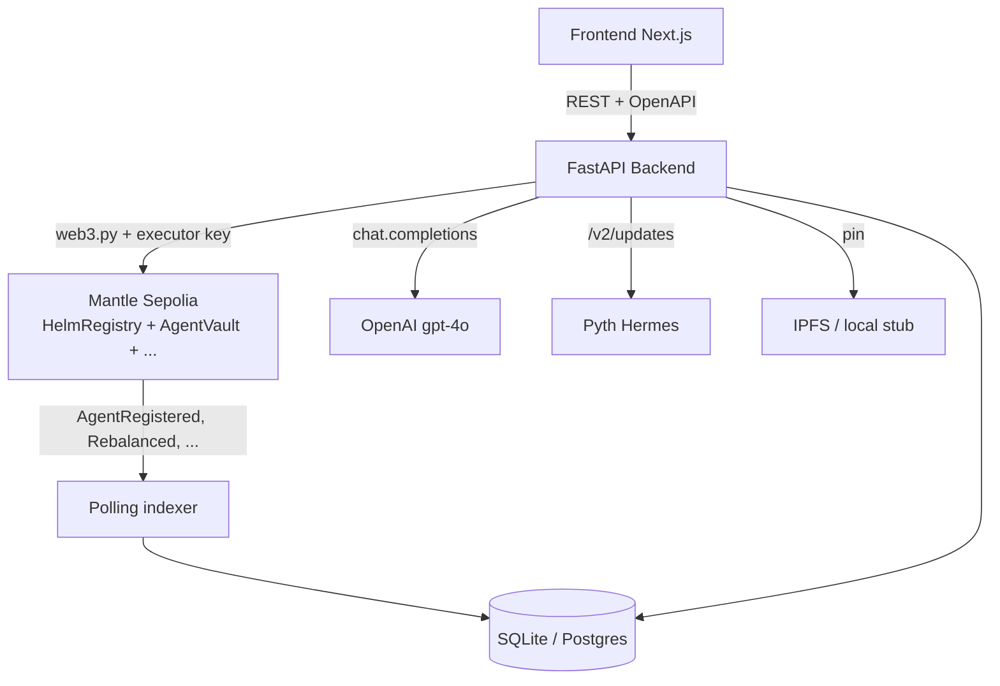

# Helm Backend

**Tokenized AI-managed ETFs on Mantle.**

A founder writes a fund mandate in natural language; an AI agent autonomously
manages the portfolio inside those constraints, posts weekly notes to holders,
and distributes yield on-chain.

- Track: **Mantle Turing Test 2026 — AI × RWA**
- Chain: Mantle Sepolia (chainId 5003)
- Demo video: _TBD_
- Live demo: _TBD_

---

## What is Helm

- Founder pins a mandate (asset universe, weight bands, lockup tiers, carry,
  emergency exits) on IPFS. An LLM parser turns natural language into the
  on-chain `MandateSchema`; protocol locks (carry = 10%, max leverage = 1.0)
  override anything the founder says.
- Each agent gets its own **ERC-4626 vault** (holds USDC + synthetic equities
  + mETH + USDY), **ERC-20 share token** (transferable), and **ERC-8004
  identity NFT** (reputation, mandate URI, weekly notes).
- Yield (USDY rate + mETH staking) → **90% USDC dividend to share holders,
  10% founder carry**. Capital gains stay in NAV.
- A 30-day incubation window gates founder-only deposits before public
  launch. Founder shares are subordinated and locked ≥ 90 days. Mandate
  breaches trigger automatic wind-down + reputation slash.

---

## Architecture



| Component | Responsibility |
| --- | --- |
| Frontend | Marketplace listing, agent detail, mandate authoring UI |
| FastAPI | REST API + OpenAPI source-of-truth + admin demo triggers |
| Indexer | Polls registry / NFT / per-vault events → DB rows (idempotent) |
| Services | `rebalance`, `harvest`, `distribute`, `nft_metadata` — chain writes |
| Mandate parser | OpenAI function-call → typed `MandateSchema` (protocol-locked fields enforced) |
| Narrator | Weekly markdown note per agent — pinned into NFT metadata |
| SC layer | Registry, vault clones, NFT, dividend distributor, Pyth-priced synthetics |

---

## Rug-Pull Protection

Helm enforces founder subordination through a **preventive** mechanism —
stronger than the spec-aligned reactive design.

### Mechanism comparison

| Spec | Implementation |
| --- | --- |
| **Reactive** (IDEA) | Allow dev withdrawal up to 50%, then trigger wind-down |
| **Preventive** (current) | Block dev withdrawal at 40% subordination threshold |

In the preventive model, the `FounderVault.withdraw()` call reverts if the
cumulative withdrawn percentage would exceed 4000 bps (40%). This means the
attack vector "dev drains and then triggers wind-down to escape with most
capital" is **structurally impossible** — the dev cannot reach the trigger
state because the contract refuses the transaction.

Wind-down can still be initiated via:

- `signalWindDown()` — manual trigger by dev (legitimate exit)
- `notifyMandateBreach()` — registry-driven on mandate violation
- Reputation slash threshold

### Demo narrative

> "Most rug-pull protections are reactive — they trigger after the dev has
> already extracted capital. Helm's design is preventive: the contract
> simply refuses to release founder funds beyond 40%. The attack surface
> isn't 'minimize damage', it's 'eliminate the attack'."

---

## Repo layout

```
backend/
├── app/
│   ├── main.py              FastAPI routes + APScheduler lifespan
│   ├── config.py            pydantic-settings (.env → typed settings)
│   ├── schemas.py           Pydantic v2 — single source of truth
│   ├── chain/               web3 client, ABI loader, executor wallet, ABIs
│   ├── indexer/             listener, dispatcher, per-contract handlers
│   ├── services/            rebalance, harvest, distribute, nft_metadata
│   ├── mandate/             parser (OpenAI), hash, IPFS pinner
│   ├── narrator/            weekly note generator
│   ├── repos/               SQLAlchemy queries
│   ├── db/                  ORM models, session, base
│   └── hermes/              Pyth Hermes HTTP client
├── scripts/
│   ├── extract_abis.py      forge artifacts → app/chain/abis/
│   ├── seed.py              demo agents + holders + decisions
│   ├── e2e_demo.py          full chain → indexer → DB pipeline validation
│   ├── chain_smoke_test.py  read-only chain connectivity check
│   ├── generate_notes.py    narrator CLI (supports --mock)
│   └── debug_*.py           selector → custom-error decoders for failed txs
└── alembic/                 DB migrations
```

---

## Setup

```bash
git clone <repo> && cd backend
python -m venv .venv && source .venv/bin/activate
pip install -e ".[dev]"

cp .env.example .env
# Fill in: CRON_SIGNER_PRIVATE_KEY (executor wallet with MNT),
#          OPENAI_API_KEY, MANTLE_SEPOLIA_RPC

python -m scripts.extract_abis        # copies ABIs from ../contracts/out/
python -m scripts.seed                 # populate demo data (agent_ids 9001+)
uvicorn app.main:app --reload          # API + indexer on :8000
```

OpenAPI: <http://localhost:8000/openapi.json> · Swagger: `/docs` · ReDoc: `/redoc`

---

## Demo flow

```bash
# Full chain pipeline validation (~3 min)
python -m scripts.e2e_demo

# Or trigger steps manually (admin endpoints, testnet only)
curl -X POST http://localhost:8000/admin/time/advance \
  -H "Content-Type: application/json" -d '{"seconds": 2592000}'      # +30d

curl -X POST http://localhost:8000/admin/agents/20/rebalance
curl -X POST http://localhost:8000/admin/agents/20/harvest
curl -X POST http://localhost:8000/admin/agents/20/distribute
curl -X POST http://localhost:8000/admin/agents/20/nft-metadata
```

E2E covers: `registerAgent` → vault whitelist → mint via deposit → time-warp
to public launch → rebalance → harvest → distribute → NFT metadata refresh,
each step asserting the indexer wrote the expected DB row.

---

## API surface (core)

| Route | Purpose |
| --- | --- |
| `GET /system/info` | Chain id, deployed addresses, Pyth feed IDs, fee rates |
| `GET /system/health` | Indexer + cron + LLM liveness |
| `GET /agents` | Marketplace listing (filters, sorts) |
| `GET /agents/{id}` | Agent detail + mandate + holdings + recent decisions |
| `GET /agents/{id}/nav-history` | NAV time series (24h / 7d / 30d / all) |
| `POST /mandate/parse` | NL → `MandateSchema` via OpenAI function call |
| `POST /agents/{id}/mint-preview` | Quote shares + fee for a USDC deposit |
| `GET /agents/{id}/pyth-update-bytes` | Pyth update bytes to bundle with `vault.deposit` |
| `GET /portfolio/{address}` | User holdings across agents |
| `POST /admin/time/advance` | Fast-forward `TimeProvider` (testnet only) |
| `POST /admin/agents/{id}/{rebalance\|harvest\|distribute\|nft-metadata}` | Manual service triggers (testnet only) |

Frontend types are auto-generated from `/openapi.json` via
`openapi-typescript`; do **not** hand-edit `frontend/src/lib/api-types.gen.ts`.

---

## Tech stack

- **Python 3.11+** · FastAPI · Pydantic v2 · SQLAlchemy 2.0
- **web3.py 7.x** · eth-account · OpenAI SDK 1.50+ (mandate parser, narrator)
- **APScheduler** (in-process indexer + cron) · slowapi (rate limit)
- **SQLite** for hackathon (Postgres-ready via env)
- **Mantle Sepolia** chainId 5003 · Pyth oracle · Pinata IPFS

The `anthropic` SDK is still installed as a fallback; switching back is a
one-line provider swap in `app/mandate/parser.py` and
`app/narrator/generator.py`.

---

## Deployed contracts (Mantle Sepolia)

Full machine-readable list: [`contracts/deployments/5003.json`](../contracts/deployments/5003.json).

| Contract | Address |
| --- | --- |
| `HelmRegistry` | `0x3650636cA81d0e17ED0555d0BDD06c3576bEF9f1` |
| `AgentNFT` (ERC-8004) | `0x0E39C35936E7862E3D38F3d3731B41C14012A349` |
| `PlatformTreasury` | `0x21dE0b4097ea548AbC484Ea26DccCb8c04DE1b30` |
| `YieldHarvester` | `0x8fa5cF1B5026359D0C505fC11Fba18E7a3E5f40F` |
| `DividendDistributor` | `0xB01Dc283B6e0f00CAE786205B0DA0b58D431660a` |
| `RedemptionQueue` | `0x6ed60895d45f7E8edF1d948e855624D4ba3672b3` |
| `PythPriceAdapter` | `0x73032888240D85dfC8e65c5bFcdfc1FfFB960D94` |
| `MantleMETHAdapter` | `0x73F040de5fdF22f8d54e9ceDe3618DC8CA960184` |
| `OndoUSDYAdapter` | `0x7D71111baF3DB5Fb32a02A8463d6A79D5d421C4B` |
| `TimeProvider` (testnet) | `0xeE2EE0131CCC97278FDb62B0DD38aAC7E80bF5AA` |
| MockUSDC (`MockERC20`) | `0x69Bf37d6957f996C2De5d8406D250d9fB66afb1b` |

Synthetic equities (Pyth-priced, USDC-collateralized): `sNVDA`, `sSPY`,
`sAAPL`, `sTSLA`, `sMSFT`.

---

## Deployment (Railway)

```bash
# 1. Push backend/ to a GitHub repo.
# 2. railway.app → New Project → Deploy from GitHub → pick the repo.
# 3. Railway detects Nixpacks (Python), reads `Procfile` + `railway.json`.
# 4. In Variables tab set every key from .env.example (mandatory: RPC, executor
#    key, OPENAI_API_KEY, deployed contract addresses, CORS_ORIGINS).
# 5. Add a Volume mounted at `/data` and set:
#       DATABASE_URL=sqlite:////data/helm.db
```

| File | Purpose |
| --- | --- |
| `Procfile` | `web: bash ./scripts/entrypoint.sh` |
| `scripts/entrypoint.sh` | `alembic upgrade head` → seed-if-empty → `uvicorn` on `$PORT` |
| `railway.json` | Builder + healthcheck (`/health`, 30s) + restart policy |
| `requirements.txt` | Pinned deps for Nixpacks `pip install -r` |

Verify after deploy: `GET <railway-url>/health` (→ `{ok, db, chain}`),
`/system/info`, `/agents`. Add the FE Vercel URL to `CORS_ORIGINS` once
the frontend is live.

---

## Tests / lint

```bash
ruff check app/
pytest -v        # tests not yet authored — slot reserved
```

---

## Hackathon submission

- Track: **Mantle Turing Test 2026 — AI × RWA**
- Demo video: _TBD_
- Live demo: _TBD_
- Team: solo
