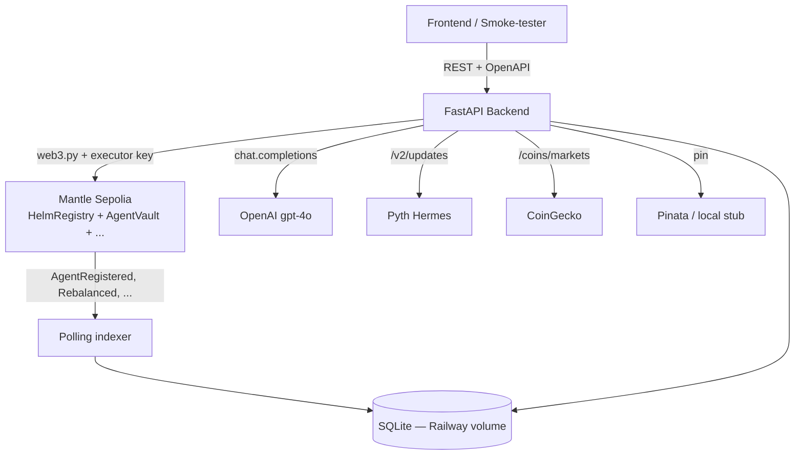

# Helm Backend

**Tokenized AI-managed ETFs on Mantle.**

A founder writes a fund mandate in natural language; an AI agent autonomously
manages the portfolio inside those constraints, posts weekly notes to holders,
and distributes yield on-chain. This is the **FastAPI backend**: REST surface,
on-chain indexer, executor for AI-driven service calls, and the LLM seam for
mandate parsing + narration.

| | |
| --- | --- |
| Production API | <https://web-production-acacf1.up.railway.app> |
| Swagger UI | [`/docs`](https://web-production-acacf1.up.railway.app/docs) |
| OpenAPI JSON | [`/openapi.json`](https://web-production-acacf1.up.railway.app/openapi.json) |
| Visual smoke tester | [`/static/test.html`](https://web-production-acacf1.up.railway.app/static/test.html) — vanilla JS + viem, walks every public, admin, and wallet flow |
| Health probe | [`/health`](https://web-production-acacf1.up.railway.app/health) |
| Chain | Mantle Sepolia (chainId `5003`) |
| Track | Mantle Turing Test 2026 — AI × RWA |

---

## What Helm does

- Founder writes a mandate (asset universe, weight bands, lockup tiers,
  carry, emergency exits) in natural language. An LLM parser maps it to the
  typed `MandateSchema`; protocol locks (`carryBps = 1000`, `maxLeverage =
  1.0`, founder lockup ≥ 90d) override anything the founder says.
- Each agent gets its own **ERC-4626 vault** (USDC + synthetic equities +
  mETH + USDY), **ERC-20 share token** (transferable), and **ERC-8004
  identity NFT** (reputation, mandate URI, lifetime stats).
- Yield (USDY rate + mETH staking) → **90% USDC dividend to share holders,
  10% founder carry**. Capital gains stay in NAV — no HWM, no forced sell.
- A 30-day incubation gates founder-only deposits before public launch.
  Founder shares are subordinated and locked ≥ 90 days. Mandate breaches
  trigger automatic wind-down + reputation slash.

---

## Architecture



| Component | Responsibility |
| --- | --- |
| FastAPI app (`app/main.py`) | REST surface, OpenAPI source-of-truth, admin demo triggers, static smoke-test page |
| Indexer (`app/indexer/`) | Polls registry / NFT / per-vault / distributor / queue / founder-vault events → idempotent DB rows |
| Services (`app/services/`) | `rebalance`, `harvest`, `distribute`, `nft_metadata`, `qualification` — chain writes via executor wallet |
| Mandate parser (`app/mandate/parser.py`) | OpenAI function-call → typed `MandateSchema`, protocol-locked fields enforced |
| Narrator (`app/narrator/generator.py`) | Personality-aware weekly markdown notes, pinned into NFT metadata |
| Analytics + benchmark (`app/repos/analytics.py`, `benchmark.py`) | Sharpe / total return / max DD / reputation premium / sSPY+60-40 comparison |
| Bybit-replacement (`app/services/coingecko_client.py`) | BTC/ETH price + 24h change for mandate emergency-exit DSL |

### Startup hook

FastAPI's `lifespan` runs `app.repos.agents.sweep_stale_agents()` **before**
the indexer wakes up: each Agent row whose `vault.registry()` doesn't match
the BE's configured `helm_registry` env, or whose vault has no on-chain
code, is `cascade`-deleted (along with positions, NavPoints, decisions,
holders, dividend epochs, founder vault, etc.). This makes a registry
re-deploy non-fatal — the next BE boot self-cleans, then `scripts/seed.py`
re-registers the demo agents against the current chain config.

### `scripts/seed.py` — chain-backed, idempotent

Background-launched by `scripts/entrypoint.sh` on every boot. Flow:

1. Sweep stale agents (defense in depth — the lifespan also calls this, but
   seed runs as a background process so the order can interleave).
2. For each demo mandate (TEC, DTECH), compute `mandate_hash`. If a row
   already exists for that hash, skip. Otherwise:
   - Self-mint 1000 USDC via `MockERC20.mint` (executor key is registered
     as a `MockERC20` minter on testnet — chainId-gated).
   - `registry.registerAgent(...)` on-chain. The indexer picks up the
     `AgentRegistered` event and inserts the Agent row with the chain-
     assigned `agentId`. **Legacy IDs 9001 / 9002 are gone — chain decides.**
3. For TEC only, run the full lifecycle: `step2_deposit` → `step3` time-
   advance + `advanceToPublic` → `step4` rebalance + harvest + distribute
   + nft_metadata. A partial failure here (e.g. a rebalance revert from
   Pyth amount math) is caught and logged — DTECH still gets registered.

Backgrounding seed is what keeps Railway's 30 s healthcheck happy: the
full lifecycle takes 3–5 min, but uvicorn comes up immediately. Seed
progress is written to `/tmp/seed.log` inside the container.

---

## Production

Hosted on **Railway** (hobby plan, single web service). Indexer runs in the
FastAPI lifespan — no separate worker. SQLite on a `/data` volume mount.

| File | Purpose |
| --- | --- |
| `Procfile` | `web: bash ./scripts/entrypoint.sh` |
| `scripts/entrypoint.sh` | `alembic upgrade head` → seed-if-empty → `uvicorn` on `$PORT` |
| `railway.json` | Builder + healthcheck (`/health`, 30s) + restart policy |
| `requirements.txt` | Pinned deps for Nixpacks `pip install -r` |

After deploy, verify: `GET /health` → `{ok, db, chain}`, `/system/info`,
`/agents`. Add the FE Vercel URL to `CORS_ORIGINS` once the frontend ships.

---

## Local development

```bash
git clone <repo> && cd backend
python -m venv .venv && source .venv/bin/activate
pip install -e ".[dev]"

cp .env.example .env
# Fill in: CRON_SIGNER_PRIVATE_KEY (executor wallet with MNT),
#          OPENAI_API_KEY, MANTLE_SEPOLIA_RPC, deployed contract addresses

python -m scripts.extract_abis     # ABIs from ../contracts/out/
alembic upgrade head               # create / migrate SQLite schema
python -m scripts.seed             # registers TEC + DTECH on-chain (chain assigns agentId)
uvicorn app.main:app --reload      # API + indexer on :8000
```

Or one-shot reset (kill + wipe DB + reseed + restart):

```bash
bash scripts/reset_demo.sh
```

Browse:

- Swagger: <http://localhost:8000/docs>
- Smoke tester: <http://localhost:8000/static/test.html>

---

## Key endpoints

Full surface lives in the auto-generated [`/openapi.json`](https://web-production-acacf1.up.railway.app/openapi.json) — that
is the master, hand-edited docs drift. Sampled below for orientation:

| Route | Purpose |
| --- | --- |
| `GET /health` | Liveness probe (db ping + chain ping) — used by Railway healthcheck |
| `GET /system/info` | Chain id, all deployed addresses, Pyth feed IDs, fee rates |
| `GET /agents` | Marketplace listing — filter on phase/asset class/lockup, sort by sharpe/return/drawdown/reputation/… |
| `GET /agents/{id}` | Full detail — mandate, positions, decisions, narrator note, performance, market premium |
| `GET /agents/{id}/nav-history` | NAV time series (`24h / 7d / 30d / all`) |
| `GET /agents/{id}/decisions` | Paginated decision log (Rebalance / Harvest / Distribute / WindDown) |
| `GET /agents/{id}/benchmark` | Agent return vs sSPY 10%/yr vs 60/40 7.6%/yr — series + summary |
| `GET /agents/{id}/conditions` | Live evaluation of mandate `emergencyExitConditions` against CoinGecko BTC/ETH |
| `GET /agents/{id}/pyth-update-bytes` | Pyth `updateData[]` + MNT fee for the user's `vault.mint` |
| `POST /agents/{id}/mint-preview` | Quote shares + fee for a USDC deposit (no tx) |
| `POST /mandate/parse` | NL mandate → typed `MandateSchema` via OpenAI function-call |
| `POST /mandate/validate` | Validate a hand-edited mandate (no LLM call) |
| `GET /portfolio/{address}` | Per-wallet holdings, pending dividends, redemptions |
| `GET /admin/agents/{id}/qualify` | Phase-2 qualification check (6 criteria) |
| `POST /admin/agents/{id}/{rebalance\|harvest\|distribute\|nft-metadata}` | Manual service triggers (testnet) |
| `POST /admin/time/advance` · `POST /admin/mint-usdc` | Demo automation (testnet) |
| `GET /admin/debug/*` | Chain inspector — synthetic prices, adapters, treasury, indexer state, BE↔SC compare |

Frontend types are generated from `/openapi.json` via `openapi-typescript`.
**Do not hand-edit type files** — see [`https://github.com/helmfinance/contracts/blob/main/frontend-package/INTEGRATION.md`](https://github.com/helmfinance/contracts/blob/main/frontend-package/INTEGRATION.md).

---

## Architecture decisions

1. **REIT 90/10 split, not HWM** — Yield (interest + staking) is dividended
   90/10 to holders/founder. Capital gains stay in NAV, no forced sell. Aligns
   founder with long-term NAV growth without the HWM griefing that broke
   YearnV1-era vaults.

2. **Push-based Pyth, FE bundles update bytes** — BE serves `updateData[]`
   via `/agents/{id}/pyth-update-bytes`. FE attaches them to `vault.mint` with
   `msg.value = updateFee`. Mint reverts on stale price instead of silently
   pricing off old data. Trade-off: one extra fetch per mint, no FE crypto
   pain.

3. **Indexer is the audit log, not a cache** — Every SC state-changing call
   emits an event; BE never queries chain state for read endpoints. Indexer
   handlers are idempotent on `(tx_hash, log_index)`, so re-running a chunk
   is safe. SQLite is the source of truth for the API; chain is the source of
   truth for the indexer.

4. **AI is narrator + parser, not decision-maker** — Rebalance / harvest /
   distribute logic is **deterministic Python** (`app/services/`). LLM only
   (a) parses NL mandates into the typed schema (function-calling, schema
   enforced server-side), and (b) writes the weekly note (`gpt-4o`,
   personality-aware system prompt). Decisions never depend on LLM output.

5. **Preventive subordination** — `FounderVault.withdraw()` reverts past the
   40% threshold. The attack "dev drains then triggers wind-down to escape
   with most capital" is structurally impossible — the dev cannot reach the
   trigger state. See [Rug-Pull Protection](#rug-pull-protection) below.

6. **CoinGecko over Bybit** — Original `condition_evaluator` called Bybit
   public API. Railway US-East egress is geo-blocked by Bybit, so every fetch
   silently returned `None` and the condition DSL never triggered. Switched
   to CoinGecko (no auth, no geo restriction). Funding rate is lost in the
   trade — gracefully reported as "Metric unavailable".

---

## Rug-Pull Protection

Helm enforces founder subordination through a **preventive** mechanism —
stronger than the spec-aligned reactive design.

| Spec | Implementation |
| --- | --- |
| **Reactive** (IDEA) | Allow dev withdrawal up to 50%, then trigger wind-down |
| **Preventive** (current) | Block dev withdrawal at 40% subordination threshold |

`FounderVault.withdraw()` reverts if cumulative withdrawn % would exceed
4000 bps. The "dev drains and then triggers wind-down to escape with most
capital" attack vector is **structurally impossible** — the contract refuses
the tx before the trigger state is reachable.

Wind-down can still be initiated legitimately via:

- `signalWindDown()` — manual dev exit
- `notifyMandateBreach()` — registry-driven on mandate violation
- Reputation slash threshold

> "Most rug-pull protections are reactive — they trigger after the dev has
> already extracted capital. Helm's design is preventive: the contract
> simply refuses to release founder funds beyond 40%. The attack surface
> isn't 'minimize damage', it's 'eliminate the attack'."

---

## Repo layout

```
backend/
├── app/
│   ├── main.py              FastAPI routes + APScheduler lifespan + /health
│   ├── config.py            pydantic-settings (.env → typed settings)
│   ├── schemas.py           Pydantic v2 — single source of truth
│   ├── converters.py        SQLAlchemy row → Pydantic response
│   ├── chain/               web3 client, ABI loader, executor wallet
│   ├── indexer/             listener, dispatcher, handlers (registry/vault/nft/distributor/queue/founder)
│   ├── services/            rebalance, harvest, distribute, nft_metadata, qualification, condition_evaluator, coingecko_client
│   ├── mandate/             parser (OpenAI), rules, hash, IPFS pinner
│   ├── narrator/            personality-aware weekly note generator
│   ├── repos/               agents / analytics / benchmark / portfolio / mandates queries
│   ├── db/                  ORM models, session, base
│   └── hermes/              Pyth Hermes HTTP client
├── scripts/
│   ├── entrypoint.sh        Railway/Docker entrypoint (migrate → seed → uvicorn)
│   ├── reset_demo.sh        Local one-shot reset
│   ├── extract_abis.py      forge artifacts → app/chain/abis/
│   ├── seed.py              chain-registers TEC (full lifecycle) + DTECH (Incubation)
│   ├── e2e_demo.py          full chain → indexer → DB pipeline validation
│   ├── chain_smoke_test.py  read-only chain connectivity check
│   └── generate_notes.py    narrator CLI (supports --mock)
├── static/test.html         Vanilla JS + viem + Chart.js smoke-test page (~60 KB)
├── alembic/                 DB migrations
├── Procfile · railway.json · requirements.txt    Deployment
└── pyproject.toml · .env.example
```

---

## Tech stack

- **Python 3.11+** · FastAPI · Pydantic v2 · SQLAlchemy 2.0 · Alembic
- **web3.py 7.x** · eth-account · OpenAI SDK (mandate parser, narrator)
- **APScheduler** (in-process indexer) · slowapi (per-IP rate limit)
- **SQLite** (Railway `/data` volume, Postgres-ready via `DATABASE_URL`)
- **Mantle Sepolia** (chainId 5003) · **Pyth** (push oracle) · **Pinata** IPFS (local-stub fallback)

`anthropic` SDK is still installed as a one-line provider swap option in
`app/mandate/parser.py` and `app/narrator/generator.py`.

---

## Deployed contracts (Mantle Sepolia)

Full machine-readable list: [`https://github.com/helmfinance/contracts/blob/main/deployments/5003.json`](https://github.com/helmfinance/contracts/blob/main/deployments/5003.json).
FE-facing package (ABIs, addresses, events, constants): [`https://github.com/helmfinance/contracts/tree/main/frontend-package`](https://github.com/helmfinance/contracts/tree/main/frontend-package).

| Contract | Address |
| --- | --- |
| `HelmRegistry` | `0x069719287B7234f9B005Be16766702dD53047b84` |
| `AgentNFT` (ERC-8004) | `0x5099bd07CEFf8B0Eb9824F0BCa52293F4b8eb2C1` |
| `PlatformTreasury` | `0x4A19662901Cd6326fB0052BCDfbfD5b504eFd3B5` |
| `YieldHarvester` | `0x5486eD748244f0823d48D71268Fd92735eb356d1` |
| `DividendDistributor` | `0xc0F99830BE04835B97F07BA927589FE1c2cCbd50` |
| `RedemptionQueue` | `0xECed7c86B3c3848f853B43519a080FB3e6815A4e` |
| `PythPriceAdapter` | `0xe666D9e73E9AF83B0e0d21B03126661Eb1B8cB9e` |
| `MantleMETHAdapter` | `0x8ae0c4B70a90406bb593457751029379E1779f6B` |
| `OndoUSDYAdapter` | `0x025f9E23C5a3962505Bb580009b0c47c820dd241` |
| `TimeProvider` (testnet) | `0x0A7aeB1c658A672C6794C36818dFFEe4bAcB082F` |
| MockUSDC (`MockERC20`) | `0x468dAe9a460ABAb95e950d6113F199A6a0123906` |

Synthetic equities (Pyth-priced, USDC-collateralized): `sNVDA`, `sSPY`,
`sAAPL`, `sTSLA`, `sMSFT`.

---

## Testing

```bash
ruff check app/                # lint
pytest -v                      # unit tests — placeholder slot, not yet authored
python -m scripts.e2e_demo     # end-to-end chain → indexer → DB pipeline (~3 min)
python -m scripts.chain_smoke_test    # read-only connectivity check
```

The visual smoke tester at `/static/test.html` is the closest thing to an
integration test today — it exercises every public, admin, and wallet flow
in one page with explorer links for every tx.

---

## Troubleshooting

- **Railway auto-deploy didn't trigger after push** — webhook occasionally
  stalls. Force redeploy: empty commit `git commit --allow-empty -m "chore:
  trigger railway redeploy" && git push`, or use the Railway CLI: `railway up`.
- **Indexer hangs on first cycle after restart** — `seed.py` anchors
  `IndexerState.last_synced_block` to `chain head - 100`. If the value is
  stale (very old DB), the catch-up sweeps millions of blocks. Either re-seed
  or manually update the row.
- **`/conditions` shows "Metric unavailable"** — CoinGecko rate-limited (60s
  TTL cache mitigates this) or `BTC_FUNDING_RATE` is referenced (CoinGecko
  free tier doesn't expose funding rate; only Bybit did).
- **MetaMask shows the wrong wallet picker each click** — `static/test.html`
  uses EIP-6963 + caches `window.helmProvider` on first connect. Re-connect
  if you change wallets.
- **`waitForTransactionReceipt` timeout on Mantle Sepolia** — block time is
  10–30s. Use `timeout: 60_000, pollingInterval: 2_000`. Timeout ≠ tx
  failure — fall back to the explorer link.
- **SQLite write failures on Railway** — confirm the `/data` volume is
  mounted and `DATABASE_URL=sqlite:////data/helm.db` (four slashes for an
  absolute path).

---

## Further reading

- [`https://github.com/helmfinance/contracts`](https://github.com/helmfinance/contracts) — Solidity source, deploy script, Foundry tests
- [`https://github.com/helmfinance/contracts/tree/main/frontend-package`](https://github.com/helmfinance/contracts/tree/main/frontend-package) — ABIs, addresses, events, constants, FE integration guide
- [`https://github.com/helmfinance/contracts/blob/main/IDEA.md`](https://github.com/helmfinance/contracts/blob/main/IDEA.md) — original product/protocol spec
